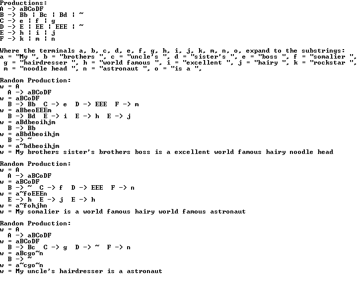

Attempt at simple Natural Language generator using C/C++.

Takes productions and terminals for a Context Free Grammar and randomly creates sentences using them. Five sets of Terminals and five sets of productions are included to test the generator. Each of the 5 are tested randomly 3 times.

